# ChemWatch — Entity-Relationship Diagram

## Full ER Diagram

```mermaid
erDiagram
    %% ══════════════════════════════════════════════════
    %% MASTER DATA
    %% ══════════════════════════════════════════════════

    Role {
        uuid Id PK
        string Name UK "max 50"
        string DisplayName "max 100"
        string Description
        bool IsActive
        datetime CreatedAt
        datetime UpdatedAt
    }

    Location {
        uuid Id PK
        string Name "max 100"
        string Code UK "max 10"
        string Address
        bool IsActive
        datetime CreatedAt
        datetime UpdatedAt
    }

    Lab {
        uuid Id PK
        uuid LocationId FK
        string Name "max 100"
        string Code "max 20"
        string Description
        bool IsActive
        datetime CreatedAt
        datetime UpdatedAt
    }

    User {
        uuid Id PK
        string Email UK "max 255"
        string PasswordHash "max 255"
        string FullName "max 200"
        uuid RoleId FK
        string LocationScopeType "max 20"
        bool IsActive
        datetime LastLoginAt
        string PasswordResetToken
        datetime PasswordResetTokenExpiry
        datetime CreatedAt
        datetime UpdatedAt
    }

    UserLocation {
        uuid Id PK
        uuid UserId FK "UK(UserId+LocationId)"
        uuid LocationId FK
        datetime CreatedAt
    }

    Vendor {
        uuid Id PK
        string Name UK "max 200"
        string Code "max 20"
        string ContactEmail "max 255"
        string ContactPhone "max 50"
        string Website "max 500"
        string Address
        string Notes
        bool IsActive
        datetime CreatedAt
        datetime UpdatedAt
    }

    ItemCategory {
        uuid Id PK
        string Name UK "max 100"
        string Code UK "max 20"
        string Description
        int DisplayOrder
        bool IsActive
        datetime CreatedAt
        datetime UpdatedAt
    }

    RegulatoryType {
        uuid Id PK
        string Name UK "max 100"
        string Code UK "max 20"
        string Description
        bool IsActive
        datetime CreatedAt
        datetime UpdatedAt
    }

    Item {
        uuid Id PK
        string ItemName "max 300"
        string ItemShortName "max 100"
        string PartNo "max 100"
        string CasNo "max 50"
        uuid CategoryId FK
        uuid RegulatoryTypeId FK "nullable"
        uuid DefaultVendorId FK "nullable"
        string Type "max 50"
        string Size "max 50"
        string Unit "max 20"
        string BaseUnit "max 20"
        decimal UnitSize "numeric(18,6)"
        decimal ReferencePrice "decimal(12,2)"
        string Currency "max 3"
        int LeadTimeDays
        string Description
        string StorageConditions "max 200"
        bool IsOrderable
        bool RequiresCheckin
        bool AllowsCheckout
        bool TracksExpiry
        bool RequiresPeroxideMonitoring
        string PeroxideClass "max 20, nullable — plain string, no FK"
        bool IsRegulatoryRelated
        bool IsActive
        decimal TotalMinStock "computed"
        decimal AieMinStock "computed"
        decimal MtpMinStock "computed"
        decimal CtMinStock "computed"
        decimal AtcMinStock "computed"
        datetime CreatedAt
        datetime UpdatedAt
    }

    FavoriteItem {
        uuid Id PK
        uuid UserId FK "UK(UserId+ItemId)"
        uuid ItemId FK
        datetime CreatedAt
    }

    ItemLabSetting {
        uuid Id PK
        uuid ItemId FK "UK(ItemId+LabId)"
        uuid LabId FK
        decimal MinStock "decimal(12,3)"
        string Notes
        datetime CreatedAt
        datetime UpdatedAt
    }

    PoReference {
        uuid Id PK
        string PoNumber UK "max 50"
        uuid CategoryId FK "nullable"
        uuid LabId FK "nullable"
        uuid VendorId FK "nullable"
    }

    %% ══════════════════════════════════════════════════
    %% INVENTORY CORE
    %% ══════════════════════════════════════════════════

    InventoryLot {
        uuid Id PK
        uuid ItemId FK
        uuid LabId FK
        uuid LocationId FK
        uuid VendorId FK "nullable"
        string LotNumber "max 100"
        int QuantityReceived "CHECK > 0"
        int QuantityRemaining "CHECK >= 0"
        decimal QuantityReceivedBase "numeric(18,6), CHECK > 0"
        decimal QuantityRemainingBase "numeric(18,6), CHECK >= 0"
        string BaseUnit "max 20"
        string Unit "max 20"
        datetime ManufactureDate
        datetime OpenDate
        uuid OpenBy
        datetime ExpiryDate
        datetime FirstInspectDate
        datetime LastMonitorDate
        datetime NextMonitorDate
        string PeroxideStatus
        string StorageSublocation "max 200"
        string Status "max 20"
        string SourceType "max 20"
        uuid PurchaseRequestId FK "nullable"
        uuid PurchaseRequestItemId FK "nullable"
        uuid CheckedInBy FK
        datetime CheckedInAt
        string QrCodeData "json"
        int ExtensionCount
        int Version
        string Notes
        string ManualSourceReason "max 50"
        string CertificateOfAnalysis "max 200"
        string AssignedValue "max 100"
        string Uncertainty "max 100"
        string CertifyingBody "max 200"
        datetime CreatedAt
        datetime UpdatedAt
    }

    StockTransaction {
        uuid Id PK
        string TransactionType "max 30"
        uuid UserId FK
        string UserName "max 200"
        uuid LabId FK "nullable"
        uuid LocationId FK "nullable"
        uuid LotId FK "nullable"
        uuid PurchaseRequestId FK "nullable"
        uuid ItemId FK "nullable"
        decimal QuantityBase "numeric(18,6)"
        string Type "max 3, CHECK IN/OUT"
        string Notes
        string Metadata "json"
        datetime CreatedAt
    }

    %% ══════════════════════════════════════════════════
    %% ORDER WORKFLOW
    %% ══════════════════════════════════════════════════

    PurchaseRequest {
        uuid Id PK
        string PoNumber "max 50"
        uuid PoReferenceId FK "nullable"
        uuid LabId FK
        uuid LocationId FK
        uuid RequestedBy FK
        string Status "max 30"
        string OrderNotes
        string ApprovalNotes
        uuid ApprovedBy FK "nullable"
        datetime ApprovedAt
        string RejectedReason
        datetime SubmittedAt
        uuid LastModifiedBy
        datetime LastModifiedAt
        datetime CreatedAt
        datetime UpdatedAt
    }

    PurchaseRequestItem {
        uuid Id PK
        uuid PurchaseRequestId FK
        uuid ItemId FK
        uuid VendorId FK "nullable"
        decimal QuantityOrdered "decimal(12,3)"
        decimal QuantityReceived "decimal(12,3)"
        string Unit "max 20"
        decimal UnitPrice "decimal(12,2)"
        string LineItemNotes
        string Status "max 30"
        datetime CreatedAt
        datetime UpdatedAt
    }

    PurchaseRequestItemRevision {
        uuid Id PK
        uuid PurchaseRequestItemId FK "nullable"
        uuid PurchaseRequestId FK
        string Action "max 20"
        string FieldName "max 50"
        string OldValue
        string NewValue
        uuid RevisedBy FK
        datetime RevisedAt
        string Notes
    }

    %% ══════════════════════════════════════════════════
    %% MONITORING & TRACKING
    %% ══════════════════════════════════════════════════

    PeroxideTest {
        uuid Id PK
        uuid InventoryLotId FK
        datetime TestDate
        uuid TestedByUserId FK
        string TestMethod
        string ResultType
        decimal PpmResult
        string ResultText "max 50"
        string Classification
        string VisualObservations
        string Notes "max 500"
        datetime NextMonitorDue
        datetime CreatedAt
    }

    ShelfLifeExtension {
        uuid Id PK
        uuid InventoryLotId FK
        int ExtensionNumber
        datetime PreviousExpiryDate
        datetime NewExpiryDate
        int PreviousDaysToExpiry
        int NewDaysToExpiry
        int ExtensionDays
        string Reason "max 500"
        string TestPerformed "max 200"
        string TestResult "max 200"
        datetime TestDate
        uuid AuthorizedByUserId FK
        datetime CreatedAt
    }

    QrScanLog {
        uuid Id PK
        uuid InventoryLotId FK
        uuid ScannedByUserId FK "nullable"
        string Action "max 20"
        string IpAddress "max 50"
        string UserAgent "max 500"
        datetime ScannedAt
    }

    %% ══════════════════════════════════════════════════
    %% RELATIONSHIPS
    %% ══════════════════════════════════════════════════

    %% -- Master Data --
    Role ||--o{ User : "has many"
    Location ||--o{ Lab : "has many"
    User ||--o{ UserLocation : "has many"
    Location ||--o{ UserLocation : "has many"

    ItemCategory ||--o{ Item : "has many"
    RegulatoryType ||--o{ Item : "has many"
    Vendor ||--o{ Item : "default vendor"

    Item ||--o{ ItemLabSetting : "has many"
    Lab ||--o{ ItemLabSetting : "has many"

    User ||--o{ FavoriteItem : "has many"
    Item ||--o{ FavoriteItem : "has many"

    ItemCategory ||--o| PoReference : "optional"
    Lab ||--o| PoReference : "optional"
    Vendor ||--o| PoReference : "optional"

    %% -- Inventory Core --
    Item ||--o{ InventoryLot : "has many"
    Lab ||--o{ InventoryLot : "has many"
    Location ||--o{ InventoryLot : "has many"
    Vendor ||--o{ InventoryLot : "optional"
    User ||--o{ InventoryLot : "checked in by"

    InventoryLot ||--o{ StockTransaction : "has many"
    User ||--o{ StockTransaction : "performed by"
    Lab ||--o{ StockTransaction : "at lab"
    Location ||--o{ StockTransaction : "at location"
    Item ||--o{ StockTransaction : "for item"
    PurchaseRequest ||--o{ StockTransaction : "from PR"

    %% -- Order Workflow --
    Lab ||--o{ PurchaseRequest : "for lab"
    Location ||--o{ PurchaseRequest : "at location"
    User ||--o{ PurchaseRequest : "requested by"
    User ||--o{ PurchaseRequest : "approved by"
    PoReference ||--o| PurchaseRequest : "optional"

    PurchaseRequest ||--o{ PurchaseRequestItem : "has many"
    Item ||--o{ PurchaseRequestItem : "for item"
    Vendor ||--o{ PurchaseRequestItem : "from vendor"

    PurchaseRequest ||--o{ PurchaseRequestItemRevision : "has many"
    PurchaseRequestItem ||--o{ PurchaseRequestItemRevision : "for line item"
    User ||--o{ PurchaseRequestItemRevision : "revised by"

    %% -- Monitoring --
    InventoryLot ||--o{ PeroxideTest : "has many"
    User ||--o{ PeroxideTest : "tested by"

    InventoryLot ||--o{ ShelfLifeExtension : "has many"
    User ||--o{ ShelfLifeExtension : "authorized by"

    InventoryLot ||--o{ QrScanLog : "has many"
    User ||--o{ QrScanLog : "scanned by"
```

---

## Domain Grouping

| Domain | Entities | Description |
|--------|----------|-------------|
| **Master Data** | `Role`, `Location`, `Lab`, `User`, `UserLocation`, `Vendor`, `ItemCategory`, `RegulatoryType`, `Item`, `FavoriteItem`, `ItemLabSetting`, `PoReference` | Core reference data and catalog |
| **Inventory Core** | `InventoryLot`, `StockTransaction` | Physical stock tracking (lots, IN/OUT transactions) |
| **Order Workflow** | `PurchaseRequest`, `PurchaseRequestItem`, `PurchaseRequestItemRevision` | Purchase ordering, approval, and revision audit |
| **Monitoring** | `PeroxideTest`, `ShelfLifeExtension`, `QrScanLog` | Safety testing, expiry extensions, QR scan audit |

## Key Relationships Summary

| From | → To | FK Column | Delete Behavior |
|------|-------|-----------|-----------------| 
| `Item` | `ItemCategory` | `CategoryId` | Restrict |
| `Item` | `RegulatoryType` | `RegulatoryTypeId` | SetNull |
| `Item` | `Vendor` | `DefaultVendorId` | SetNull |
| `Lab` | `Location` | `LocationId` | Restrict |
| `User` | `Role` | `RoleId` | Restrict |
| `UserLocation` | `User` | `UserId` | Cascade |
| `UserLocation` | `Location` | `LocationId` | Cascade |
| `FavoriteItem` | `User` | `UserId` | Cascade |
| `FavoriteItem` | `Item` | `ItemId` | Cascade |
| `ItemLabSetting` | `Item` | `ItemId` | Cascade |
| `ItemLabSetting` | `Lab` | `LabId` | Cascade |
| `InventoryLot` | `Item` | `ItemId` | Restrict |
| `InventoryLot` | `Lab` | `LabId` | Restrict |
| `InventoryLot` | `Location` | `LocationId` | Restrict |
| `InventoryLot` | `Vendor` | `VendorId` | SetNull |
| `InventoryLot` | `User` | `CheckedInBy` | Restrict |
| `StockTransaction` | `InventoryLot` | `LotId` | Restrict |
| `StockTransaction` | `User` | `UserId` | Restrict |
| `StockTransaction` | `Lab` | `LabId` | Restrict |
| `StockTransaction` | `Location` | `LocationId` | Restrict |
| `StockTransaction` | `Item` | `ItemId` | Restrict |
| `StockTransaction` | `PurchaseRequest` | `PurchaseRequestId` | Restrict |
| `PurchaseRequest` | `Lab` | `LabId` | Restrict |
| `PurchaseRequest` | `Location` | `LocationId` | Restrict |
| `PurchaseRequest` | `User` | `RequestedBy` | Restrict |
| `PurchaseRequest` | `User` | `ApprovedBy` | Restrict |
| `PurchaseRequest` | `PoReference` | `PoReferenceId` | SetNull |
| `PurchaseRequestItem` | `PurchaseRequest` | `PurchaseRequestId` | Cascade |
| `PurchaseRequestItem` | `Item` | `ItemId` | Restrict |
| `PurchaseRequestItem` | `Vendor` | `VendorId` | SetNull |
| `PurchaseRequestItemRevision` | `PurchaseRequest` | `PurchaseRequestId` | Cascade |
| `PurchaseRequestItemRevision` | `PurchaseRequestItem` | `PurchaseRequestItemId` | Restrict |
| `PurchaseRequestItemRevision` | `User` | `RevisedBy` | Restrict |
| `PeroxideTest` | `InventoryLot` | `InventoryLotId` | Restrict |
| `PeroxideTest` | `User` | `TestedByUserId` | Restrict |
| `ShelfLifeExtension` | `InventoryLot` | `InventoryLotId` | Restrict |
| `ShelfLifeExtension` | `User` | `AuthorizedByUserId` | Restrict |
| `QrScanLog` | `InventoryLot` | `InventoryLotId` | Restrict |
| `QrScanLog` | `User` | `ScannedByUserId` | Restrict |
| `PoReference` | `ItemCategory` | `CategoryId` | SetNull |
| `PoReference` | `Lab` | `LabId` | SetNull |
| `PoReference` | `Vendor` | `VendorId` | SetNull |

> [!NOTE]
> `Item.PeroxideClass` is a plain string column (max 20 chars, nullable). The `PeroxideConfigRule` table was removed — peroxide classification (A/B/C) is now stored directly on the `Item` entity without a foreign key constraint.
