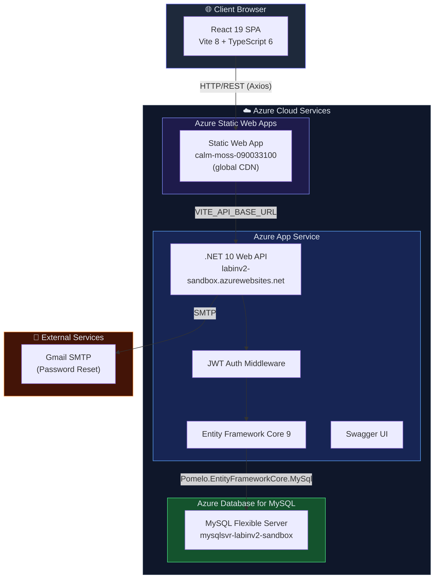
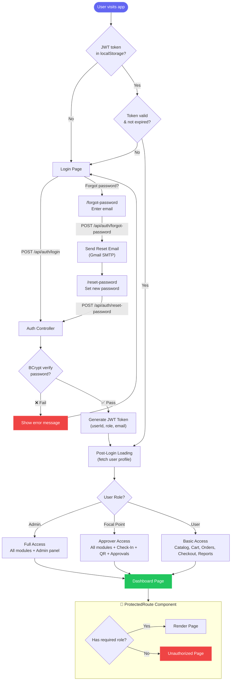
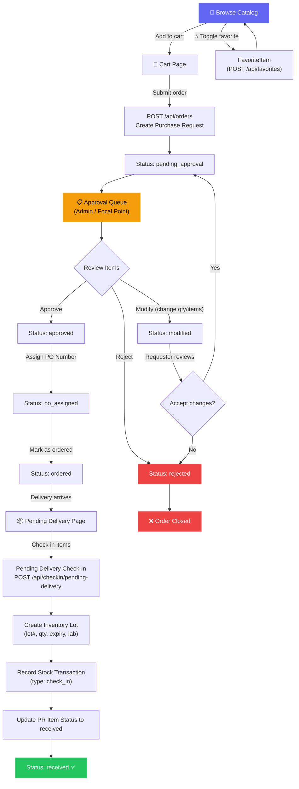
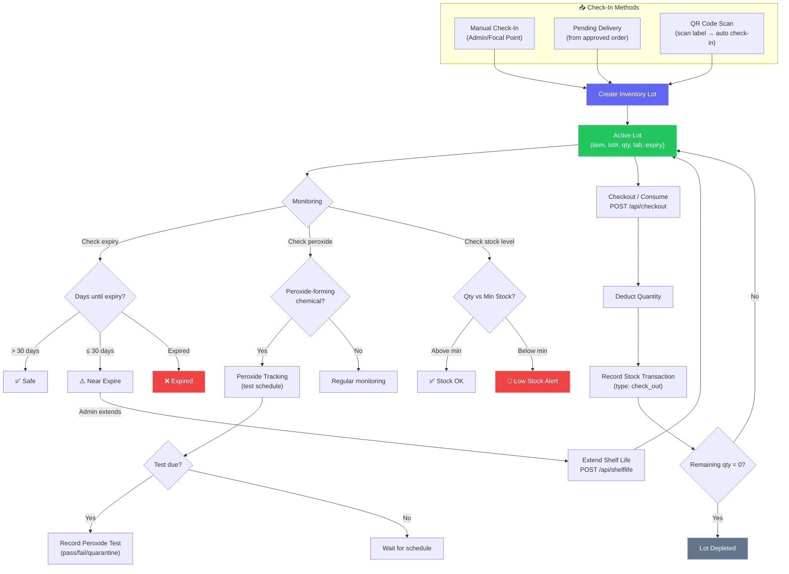
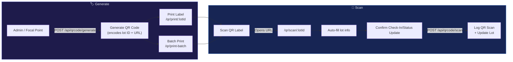
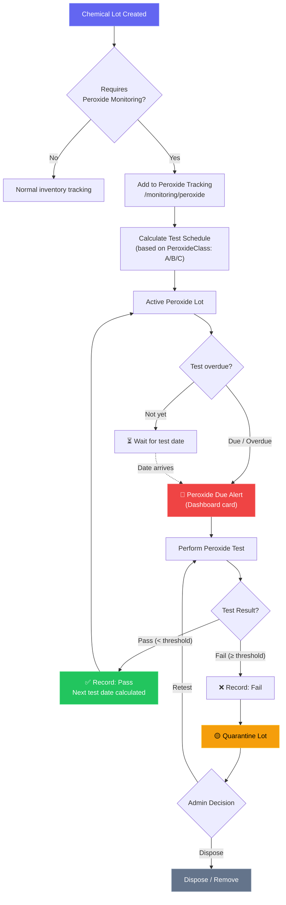
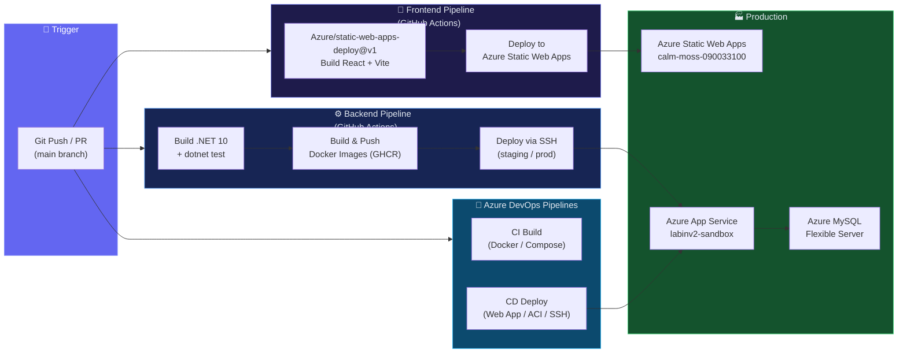
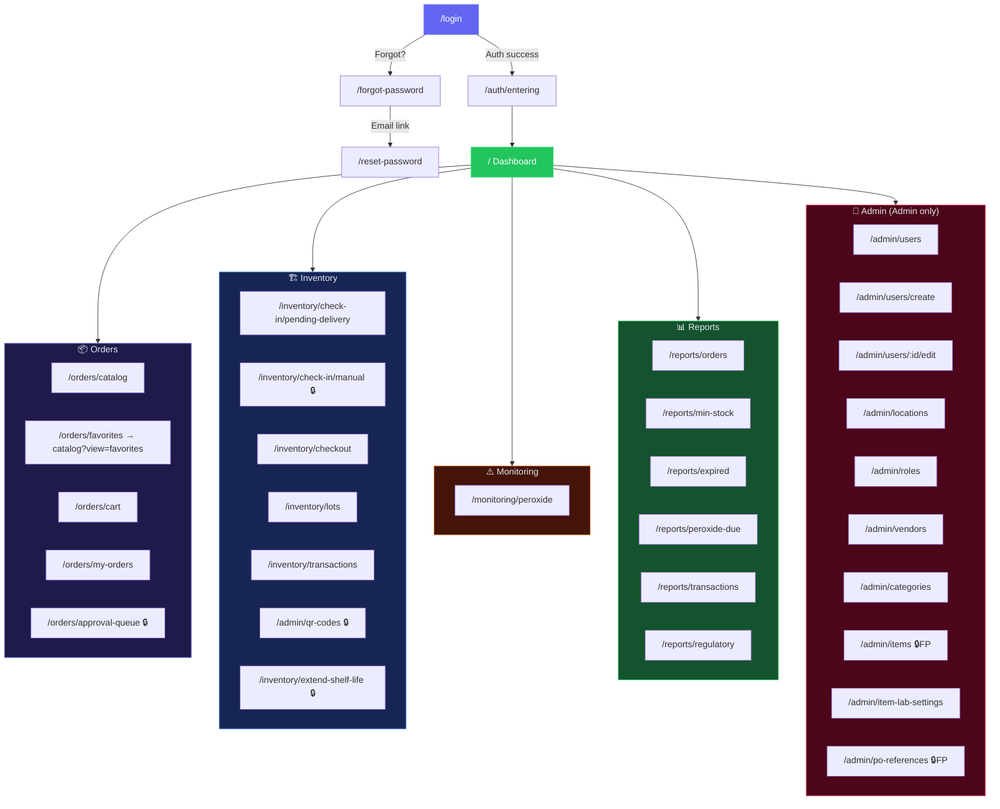
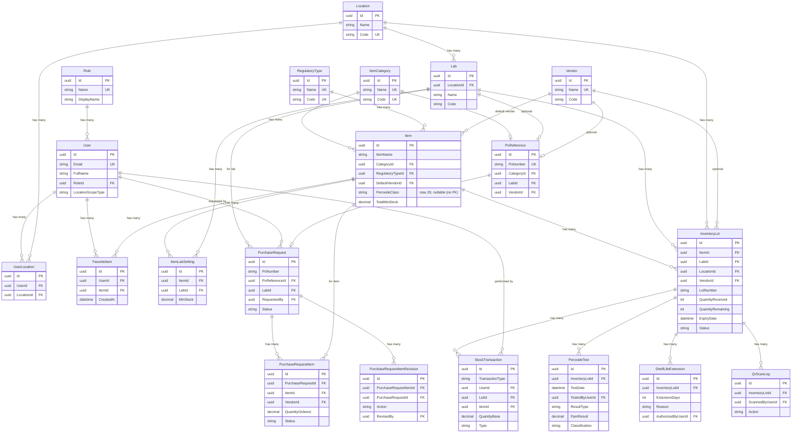
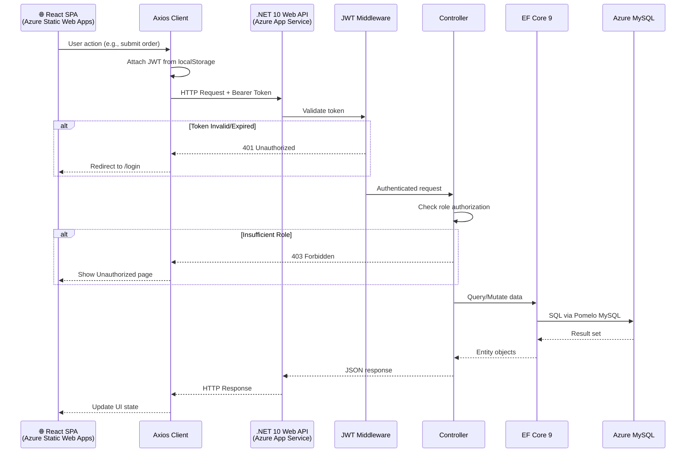

# 🧪 ChemWatch — System Flowcharts

## 1. System Architecture Overview

---

## 2. Authentication & Authorization Flow

---

## 3. Order Workflow (Purchase Request Lifecycle)

---

## 4. Inventory Lifecycle (Check-In → Checkout)

---

## 5. QR Code Workflow

---

## 6. Peroxide Safety Monitoring Flow

---

## 7. Deployment Pipeline (CI/CD)

---

## 8. Frontend Page Navigation Map

> 🔒 = Requires `admin` or `focal_point` role
> 🔒FP = Accessible by both `admin` and `focal_point`

---

## 9. Data Model (Entity Relationships)

> **Note:** For a fully detailed ER diagram with all columns and constraints, refer to the `er_diagram.md` artifact document.

---

## 10. Request-Response Flow (API Lifecycle)

